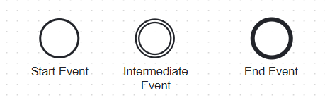
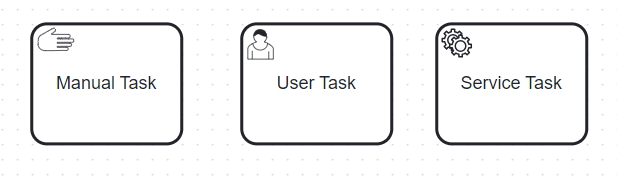
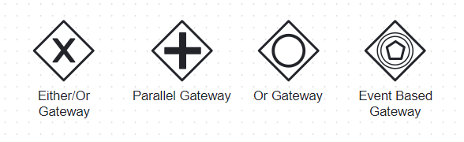
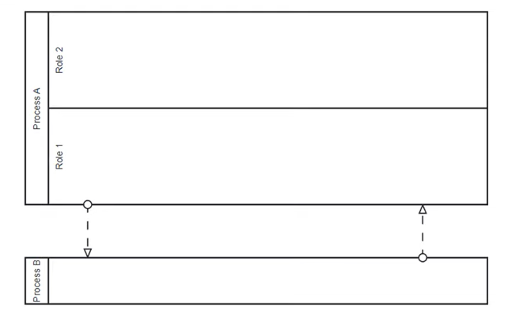

# BPMN

BPMN stands for Business Process Model Notation

Standard to model business processes, workflows and activities based on certain rules

### Components:

#### Events:
Three types:
- Start
- Intermediate
- End

#### Tasks:
Also known as activities  
Types of tasks:
- Manual Task ex moving some object, no IT system is involved
- User Task (involves human interaction)
- Service Task (no human is involved, java code / automation)

#### Gateways:
Helps to make decisions and route the flow accordingly.  
Types:
- Either/Or gateway -- also known as `exclusive gateway`, used for decision making
- Parallel gateway -- To execute tasks parallely
- Or gateway  -- also known as `inclusive gateway`, can go both ways, but need to go atleast one way
- Event based -- if event happens, we go one way but if it doesn't, we go the other way

#### Pools and Lanes:
Used to describe different roles in the system.

