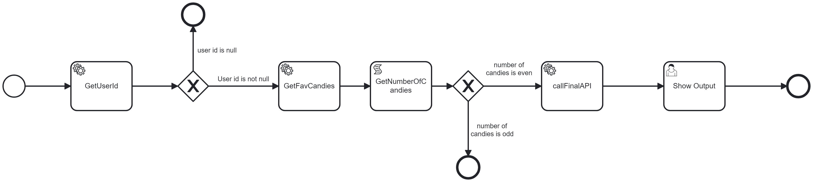

In this example, we're doing the following:
1. Passing username to Camunda
2. Calling `/getUserId` endpoint and fetching the `userId`
3. If `userId` is not null, we're calling `/getFavCandies` endpoint and getting user's favorite candies
4. From the response, we're counting the number of candies
5. If the number of candies is even, we proceed to call the final API 

## Diagram Description:
#### 1. GetUserId
   a. Define a connector with id `http-connector`
       
   
   b. Store the input payload in `get_user_id_payload` variable  
       
   
   c. Specify connector inputs - `headers`, `method`, `payload`, `url`

   d. Fetch `userId` from response and store it in `user_id` variable  
       

#### 2. Next, a `Gateway` is added to check if userId is null or not

  

#### 3. Next, another REST call is made to fetch favorite candies and store it in `favCandiesResponse` variable (Same as step 1)

#### 4. Then, a `script task` is added to fetch the number of candies returned by the previous task
  

#### 5. Another decision node is added to check if the number of candies is odd or even

  

#### 6. Finally, the final api is called

> Note: An extra user task `Show Output` is added because the process terminates after the final API call and the community version does not show the history of execution. Adding the human task makes the process wait at that step

## Execution:
#### 1. Deploy the BPMN via modeler 
#### 2. Go to tasklist and click on `Start Process`
  a. Select the process `Number of Candies`  
  b. Add a new vaiable `userIdPayload`, set type to `String` and put the payload  
  

#### 3. Check the execution instance for all variables and execution status

